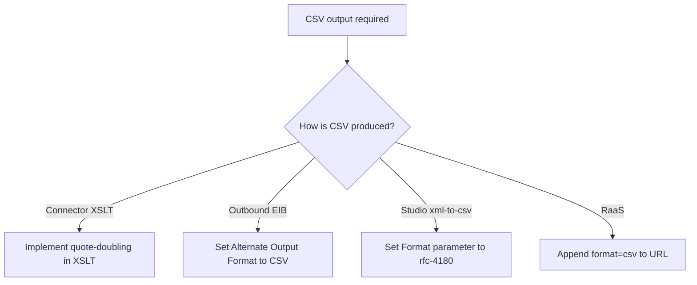
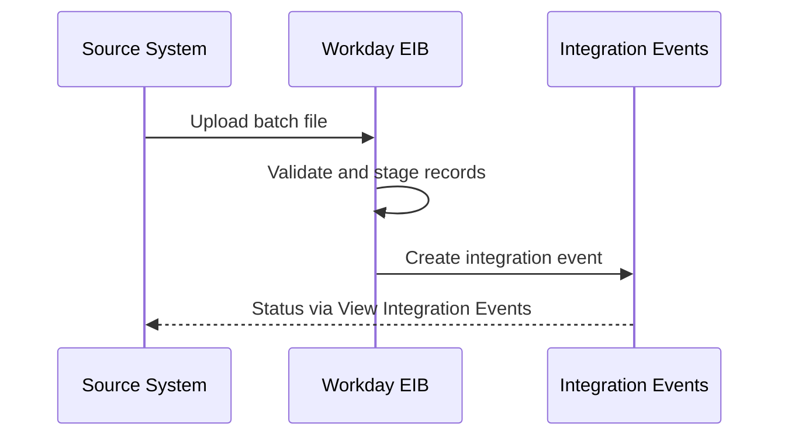
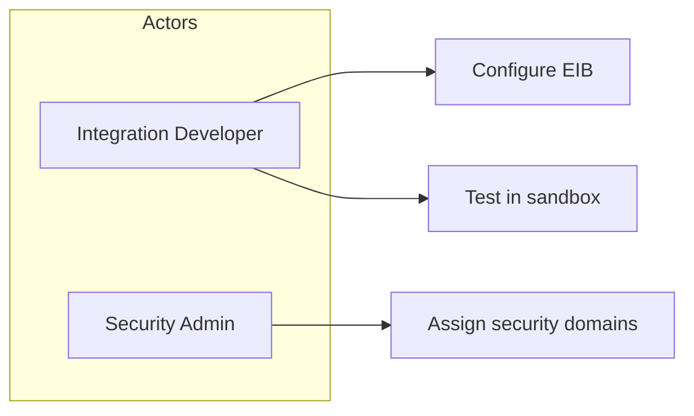
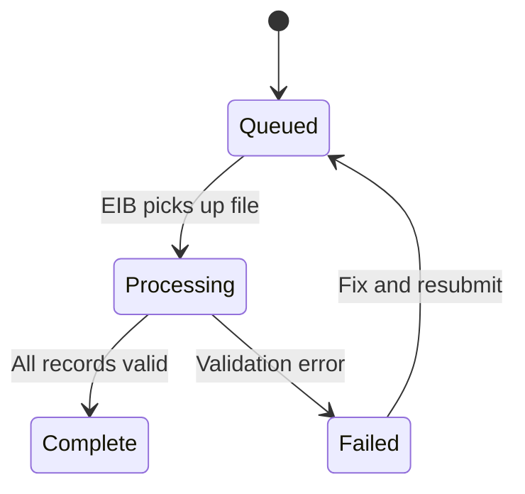

# UML Diagrams in Knowledge Articles (optional)

**Optional style** — use when prose or bullet lists would bury the reader in **if / else** branches, parallel paths, or back-and-forth message flows. Skip diagrams for simple fixes; prose, tables, and step express remain the default.

Salesforce TinyMCE does **not** render Mermaid. The local markdown preview (boxes, diamonds, arrows) is **not** what Save produces. For activity flowcharts the user should **see** in the KA, render a **PNG** and embed it (below). An HTML table with `→` is a fallback when a graphic is not needed — it is not the diagram.

## When to diagram (vs. prose or table)

| Signal | Prefer |
|--------|--------|
| 2 options, mutually exclusive | Comparison **table** or one short paragraph |
| 3+ decision branches ("if Connector… else if EIB… else if Studio…") | **Activity** flowchart |
| Ordered hand-offs between systems (request → transform → response) | **Sequence** diagram |
| Multiple actors and what each can do (security, roles, integrations) | **Use case** matrix |
| States a record/integration passes through (Queued → Processing → Complete) | **State** diagram |
| One correct procedure, no branching | Numbered **steps** (step express) — not a diagram |

**Rule of thumb:** If you find yourself writing "If X, then… Otherwise, if Y… Otherwise, if Z…" more than once in the same section, **consider** a diagram instead of more prose.

## Diagram type picker

| UML style | Mermaid keyword | Use for |
|-----------|-----------------|---------|
| **Activity** (flowchart) | `flowchart TD` or `flowchart LR` | Decision trees, troubleshooting paths, "which integration type am I using?" |
| **Sequence** | `sequenceDiagram` | SOAP/REST/RaaS call order, EIB load phases, Studio component message flow |
| **Use case** | `flowchart LR` with actors, or actor/action table | Security domains, role permissions, "who can trigger X" |
| **State** | `stateDiagram-v2` | Integration event status, batch lifecycle |

Skip class, component, and deployment diagrams — they rarely help WSP consultants.

---

## Local draft (Step 4) — Mermaid

Put diagrams in **Description** (symptom / root-cause branching) or **Resolution** (fix-path branching). Add a one-sentence caption above the fence.

### Activity / decision flow (most common)

Use when resolution path depends on integration type, error code, or configuration.

```markdown
Choose the fix path based on how CSV is produced:


```

**Mermaid tips:**
- `flowchart TD` = top-down (default for troubleshooting)
- `flowchart LR` = left-right (short linear paths)
- `{Diamond}` = decision / question
- `[Rectangle]` = action or outcome
- `-->|label|` = branch label (keep labels short)

### Sequence (integration message flow)

Use when timing and direction matter (caller → Workday → downstream).

```markdown
Typical inbound EIB processing order:


```

### Use case (actors and goals)

Prefer a **table** in Salesforce when there are ≤6 actor/action pairs. Use a small flowchart when relationships are clearer visually.

```markdown
| Actor | Can do | Cannot do |
|-------|--------|-----------|
| Integration Developer | Configure EIB, run in sandbox | Publish to production without approval |
| Security Admin | Assign domains to security groups | Override EIB validation rules |
```

For a diagram-style draft:



### State (lifecycle)



---

## Salesforce (Step 5) — visual flowchart = PNG

`mdToHtml()` turns `flowchart TD/LR` into a **table rail**. That is not the Mermaid graphic. If the local draft showed a flowchart and the user expects that picture, **embed a PNG**. Do not ship the table and tell them it is the diagram.

| Draft | What to put in TinyMCE |
|-------|------------------------|
| Activity flowchart (`flowchart TD` / `LR`) the user reviewed as a graphic | **PNG** `` (default) |
| Sequence / state | HTML table (templates below) |
| Two-way comparison with no branching | Comparison table only — no diagram |

### Render a light PNG (not the Cursor dark preview)

Do not paste the dark-mode markdown preview screenshot. Render a white-background PNG:

```bash
npx --yes @mermaid-js/mermaid-cli -i flow.mmd -o flow.png -b white -t default -s 2 -w 1400
```

Keep node labels short so they wrap cleanly. Save the PNG next to `draft-REQ-######.md` and reference it from the local draft (``).

### Embed (Salesforce rewrites to `rtaImage` on Save)

```html
<p>Choose the configuration from the vendor contract:</p>
<p><br></p>
<p></p>
<p>&nbsp;</p>
```

Inline the data URI in the Playwright script with `JSON.stringify` (MCP `browser_run_code_unsafe` has **no** `require`). After Save, confirm a Description image whose `src` contains `servlet/rtaImage` and `naturalWidth > 0`.

If the user asks why they cannot see the diagram: the table rail is already in the article — **replace it with the PNG** on Edit/Save. Do not stop at an explanation.

### Activity flowchart → HTML table rail (fallback only)

Use bordered cells, arrows (`→`), and indentation for branches. Leave `<p><br></p>` before the table.

```html
<p>Choose the fix path based on how CSV is produced:</p>
<p><br></p>
<table style="border-collapse: collapse; width: 100%; margin-top: 8px;" border="1" cellpadding="8" cellspacing="0">
  <tbody>
    <tr>
      <td colspan="3" style="background-color: #f3f3f3; font-weight: 700; border: 1px solid #d8dde6;">CSV output required</td>
    </tr>
    <tr>
      <td style="border: 1px solid #d8dde6; width: 28%; vertical-align: top;"><strong>Connector (XSLT)</strong></td>
      <td style="border: 1px solid #d8dde6; width: 8%; text-align: center;">→</td>
      <td style="border: 1px solid #d8dde6;">Implement quote-doubling in XSLT</td>
    </tr>
    <tr>
      <td style="border: 1px solid #d8dde6;"><strong>Outbound EIB</strong></td>
      <td style="border: 1px solid #d8dde6; text-align: center;">→</td>
      <td style="border: 1px solid #d8dde6;">Set <strong>Alternate Output Format</strong> to <strong>CSV</strong></td>
    </tr>
    <tr>
      <td style="border: 1px solid #d8dde6;"><strong>Studio xml-to-csv</strong></td>
      <td style="border: 1px solid #d8dde6; text-align: center;">→</td>
      <td style="border: 1px solid #d8dde6;">Set <strong>Format</strong> to <code>rfc-4180</code></td>
    </tr>
    <tr>
      <td style="border: 1px solid #d8dde6;"><strong>RaaS</strong></td>
      <td style="border: 1px solid #d8dde6; text-align: center;">→</td>
      <td style="border: 1px solid #d8dde6;">Append <code>&amp;format=csv</code> to the URL</td>
    </tr>
  </tbody>
</table>
```

For nested decisions, add a **Decision** row (italic question) then child rows indented with `padding-left: 24px` on the first column.

### Sequence → HTML table

```html
<p><br></p>
<table style="border-collapse: collapse; width: 100%;" border="1" cellpadding="6" cellspacing="0">
  <thead>
    <tr>
      <th style="background-color: #f3f3f3; border: 1px solid #d8dde6; padding: 8px;">Step</th>
      <th style="background-color: #f3f3f3; border: 1px solid #d8dde6; padding: 8px;">From</th>
      <th style="background-color: #f3f3f3; border: 1px solid #d8dde6; padding: 8px;">To</th>
      <th style="background-color: #f3f3f3; border: 1px solid #d8dde6; padding: 8px;">Message / action</th>
    </tr>
  </thead>
  <tbody>
    <tr>
      <td style="border: 1px solid #d8dde6; padding: 8px;">1</td>
      <td style="border: 1px solid #d8dde6; padding: 8px;">Source system</td>
      <td style="border: 1px solid #d8dde6; padding: 8px;">Workday EIB</td>
      <td style="border: 1px solid #d8dde6; padding: 8px;">Upload batch file</td>
    </tr>
    <tr>
      <td style="border: 1px solid #d8dde6; padding: 8px;">2</td>
      <td style="border: 1px solid #d8dde6; padding: 8px;">Workday EIB</td>
      <td style="border: 1px solid #d8dde6; padding: 8px;">Integration Events</td>
      <td style="border: 1px solid #d8dde6; padding: 8px;">Create event; monitor in <strong>View Integration Events</strong></td>
    </tr>
  </tbody>
</table>
```

### Use case → actor/action table

Use the same styled comparison table as Description prose tables (`margin-top: 16px`, header row `#f3f3f3`).

---

## Do not

- Paste raw Mermaid into Salesforce HTML — it will show as plain text
- Treat `mdToHtml()` table conversion as the visual flowchart the user approved
- Embed the Cursor dark-theme Mermaid screenshot into a white KA
- Diagram a simple 2-step fix — use step express instead
- Mix a diagram **and** a duplicate prose version of every branch — caption + diagram + brief follow-up bullets for detail is enough
- Use diagrams for customer-specific data (tenant names, file names) — generalize labels

## `mdToHtml()` helper

`lib/md-to-ka-html.js` (exported via `require('./lib')`) auto-converts fenced ` ```mermaid ` flowcharts (TD/LR) to the HTML **table rail** only. Sequence and state diagrams still need manual HTML conversion using the templates above. For a graphic flowchart, skip `mdToHtml()` on that fence and embed a PNG instead.

```js
const { mdToHtml } = require('./lib');
const html = mdToHtml(draftMarkdownSection);
```
